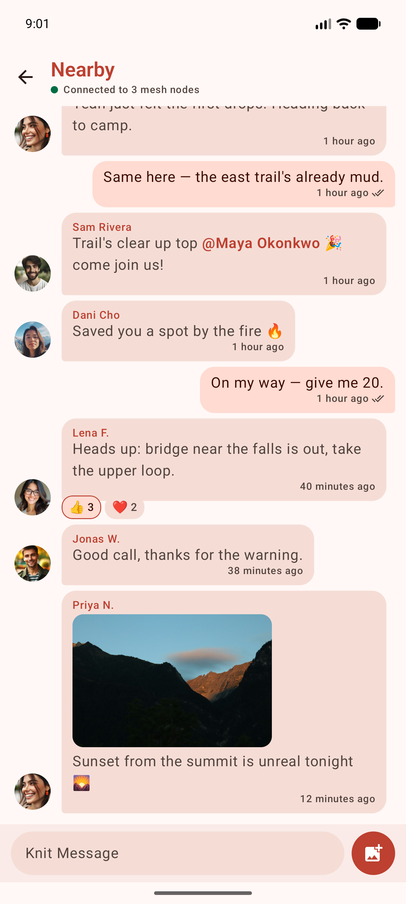

<div align="center">

# Knit

**An offline, serverless mesh messenger for Android — end-to-end encrypted, no internet, no accounts, no Google Play services.**

Your phones talk directly to each other over Wi-Fi Aware and Bluetooth LE, and relay for one another hop by hop.

🌐 **[getknit.app](https://getknit.app)** — the Knit website

-3DDC84?logo=android&logoColor=white)


[](https://github.com/getknit/knit/releases/latest)
[](https://whatsnew.fyi/product/knit)



<sub>The public <b>Nearby</b> room, relayed over Wi-Fi Aware + BLE with no internet — mentions, reactions,
delivery ticks, and image attachments included.</sub>

</div>

---

## What is Knit

Knit is an **offline peer-to-peer messaging app for Android** that needs no internet connection, no
cell service, no accounts, and no servers. It forms an ad-hoc **mesh** directly over **Wi-Fi Aware
(NAN)** and **Bluetooth LE**, running both radios at once. When you send a message, it's transmitted
to every device in range; each of those re-transmits it onward, so messages "leap-frog" across many
phones with **no infrastructure**. Duplicate copies are discarded, hop-count and TTL bound the flood,
and a store-and-forward layer carries what a single flood doesn't reach. The interface is a modern,
Signal-style messenger.

It is comparable to apps like Bridgefy, Briar, or Meshtastic, but distinguished by running **two radios
simultaneously** (Wi-Fi Aware + BLE) behind one transport seam, with **no Google Nearby / GMS
dependency** and **end-to-end encryption** on direct and group messages.

### At a glance

| | |
|---|---|
| **Category** | Offline / off-grid mesh messenger (proximity, peer-to-peer, delay-tolerant) |
| **Platform** | Android 10+ (API 29), Kotlin + Jetpack Compose (Material 3) |
| **Radios** | Wi-Fi Aware (NAN) **and** Bluetooth LE, running simultaneously — no Google Play services |
| **Encryption** | E2E on 1:1 DMs & group chats, forward-secret between current builds (X3DH-style bootstrap + epoch ratchet, AES-256-GCM, Ed25519); at-rest DB via SQLCipher |
| **Works without** | Internet, cellular, Wi-Fi routers, accounts, phone numbers, or any server |
| **License** | GPL-3.0-or-later — free and open source |

## Contents

- [Install](#-install)
- [How it works](#how-it-works)
- [Use it when](#-use-it-when)
- [Features](#-features)
- [Requirements](#-requirements)
- [Tech stack](#-tech-stack)
- [Build](#-build)
- [Running](#-running)
- [Testing](#-testing)
- [FAQ](#-faq)
- [Documentation](#-documentation)
- [Roadmap](#-roadmap)
- [Security note](#-security-note)
- [Support](#-support)
- [License](#-license)

> [!NOTE]
> Knit is feature-complete: a **"Nearby" public broadcast room**, **1:1 direct messages**, and
> **multi-member group chats**, with profiles (name / status / avatar), emoji reactions, @-mentions,
> and image attachments. **Direct and group messages are end-to-end encrypted** — bodies, mentions,
> and image attachments are readable only by their intended recipients, even though every message
> floods through relay devices. The public Nearby room is plaintext by design (no fixed recipient
> set). See the [Security note](#-security-note).

## 📥 Install

Knit needs **Android 10 (API 29) or newer** — see [Requirements](#-requirements). Both channels ship the
same app; pick one and stay on it (see the note below).

<div align="center">

[](https://play.google.com/store/apps/details?id=app.getknit.knit)
[](https://f-droid.org/packages/app.getknit.knit/)

</div>

- **Google Play** — open
  [the listing](https://play.google.com/store/apps/details?id=app.getknit.knit) (or search *Knit* in the
  Play Store app) and tap **Install**; updates arrive automatically.
- **F-Droid** — install the [F-Droid client](https://f-droid.org/) and search for *Knit*, or open
  [the package page](https://f-droid.org/packages/app.getknit.knit/) and tap **Download APK**. F-Droid
  **rebuilds Knit from source and byte-compares** the result against our published release, then
  distributes *our* signed APK verbatim — see [the reproducibility
  contract](.agents/context/distribution.md).
- **Direct APK** — the same F-Droid-verified, self-signed universal APK is attached to every
  [GitHub Release](https://github.com/getknit/knit/releases), for sideloading without any store.
- **From a nearby phone, no store or internet needed** — an installed copy of Knit can hand itself to
  another device: **Install offline** in the app menu merges its installed splits into a universal APK,
  re-signs it on-device, and sends it over Quick Share or Bluetooth. Open the received file on the other
  phone and allow installing it.

> [!IMPORTANT]
> **Play and non-Play installs carry different signatures and can't upgrade one another.** Play App
> Signing re-signs the app with Google's key, so switching between the Play build and the
> F-Droid/APK/offline-shared build requires uninstalling first — **which erases your local message history
> and identity key**. The F-Droid, GitHub-Release, and offline-shared APKs all share one signature, so
> those three interoperate and update in place.

## How it works

```
   ┌─────────┐   Wi-Fi Aware / BLE   ┌─────────┐   Wi-Fi Aware / BLE   ┌─────────┐
   │ Phone A │ ────────────────────► │ Phone B │ ────────────────────► │ Phone C │
   └─────────┘   send + relay        └─────────┘   relay (dedup)       └─────────┘
        │                                 │                                 │
   originates a           overhears & re-floods (jittered,          delivers — even though
   signed, encrypted      suppressed) — only carries ciphertext     A was never in its range
   frame once             it can't decrypt
```

Every message is a signed CBOR frame that relays forward **byte-for-byte** (they rewrite only
TTL/hop-count), so the originator's Ed25519 signature survives every hop. A relay that can't decrypt or
even recognize a frame still forwards it — an old build is never a black hole. See
[`docs/ARCHITECTURE.md`](docs/ARCHITECTURE.md) for the full protocol.

## 🧭 Use it when

Knit is built for situations where there's **no reliable network but people are physically nearby**:

- **Off-grid & remote** — hiking, camping, festivals, sailing, or anywhere without cell coverage.
- **Disaster & emergency** — earthquakes, storms, or outages that knock out cell towers and internet.
- **Crowded venues** — concerts, stadiums, and conferences where the cellular network is saturated.
- **Privacy-sensitive** — no servers, no accounts, no phone numbers; DMs and groups are end-to-end
  encrypted and identities are verifiable in person via safety numbers / QR codes.
- **Censored or shut-down networks** — communication that doesn't depend on any ISP or provider.

## ✨ Features

- **Dual-radio mesh relay** — **Wi-Fi Aware (NAN)** and **Bluetooth LE** run *simultaneously* behind a
  single `MeshTransport` seam (`CompositeMeshTransport`), no Google Nearby / GMS. Advertise + discover,
  connect to nearby peers, and flood with hop-count/TTL bounds and dedup. Relays use **jittered,
  overhear-suppressed** flooding so a dense cluster isn't stormed with redundant rebroadcasts. A device
  with only one of the two radios still meshes over that one.
- **Broadcast room, 1:1 DMs, and group chats** — a conversation list and contact picker, message
  bubbles, relative timestamps, unread badges, and delivery ticks (✓ / ✓✓).
- **End-to-end encryption with forward secrecy** for DMs and groups — each message's body, mentions,
  and image attachment are sealed with AES-256-GCM and authenticated with an Ed25519 signature, so
  relays only ever carry ciphertext. Between current builds the keys rotate: a DM session bootstraps
  from a signed prekey published in the peer's profile (X3DH-style, so the first message still needs
  no round trip) and rekeys as the conversation turns over, and groups run a sender-key ratchet on top
  of those sessions with each member driving their own chain. Message keys are dropped after use, so
  recorded ciphertext stops being readable once its epoch ages out. Peers on older builds fall back to
  the static-key scheme automatically. Identity keypairs are **hardware-backed** (AndroidKeyStore),
  advertised in profiles, pinned on first use (TOFU), and confirmable out of band via a
  **safety-number / QR-code** verification screen.
- **Store-and-forward delivery** — a message whose recipient isn't in range is held in encrypted custody
  and re-offered when they (or a path to them) later come into range, so two phones that meet only
  briefly still backfill each other. A content-digest anti-entropy layer means an idle mesh does zero
  data-path work; a new message triggers a targeted sync only with the peers that need it.
- **Reactions, @-mentions, and image attachments** — emoji reactions converge across the mesh
  (last-writer-wins) and, in DMs and groups, travel encrypted alongside delivery receipts, shaped on
  the wire like any other message; mentions get a dedicated notification; images (GIF/JPEG/PNG/WebP) are
  content-addressed and pulled on demand so the bytes don't ride the flood (encrypted attachments are
  addressed by ciphertext hash, so dedup/pull is unchanged).
- **Profiles** — display name, status, and avatar flooded across the mesh; avatars transferred as files
  (re-pushed only when they actually change) and shown next to messages.
- **On-device content moderation** — abusive-text and explicit-image (NSFW) filtering that runs
  **entirely offline** (no network, no server): a deterministic profanity filter, a bundled TFLite
  **toxicity** text classifier, and a bundled TFLite **NSFW** image classifier. Abusive **text is
  blocked on send**; explicit **images** are blocked outright in the public Nearby room and
  **allowed-but-discouraged via a "send anyway?" confirmation** in DMs/groups; both are
  **collapsed/blurred behind tap-to-reveal on receive** (receiver-side enforcement is what actually
  protects a user in a mesh), with one-tap block-sender and a user toggle. See
  [`docs/CONTENT_MODERATION.md`](docs/CONTENT_MODERATION.md).
- **Messaging-style notifications** with per-context channels (Nearby, groups, DMs) and a separate
  channel for mentions.
- **Always-on background mesh** via a foreground service, kept healthy by a heartbeat alarm,
  significant-motion re-scan, and radio-availability recovery; prompts to disable battery optimization.
- **Offline app sharing** — hand Knit to a nearby phone with no store: the installed splits are merged
  into a universal APK and re-signed on-device (ARSCLib + apksig).
- **Material 3** UI with a coral brand theme and full dark mode; encrypted at rest (SQLCipher).

## 📋 Requirements

- **Android 10 (API 29) or newer**, with **Wi-Fi Aware** and/or **Bluetooth LE** hardware. Nearly all
  phones have BLE; Wi-Fi Aware is on Pixel 3+ and many recent devices. A device with only one radio
  still meshes over it — the app is unsupported only when *neither* radio exists. No Google Play services
  required.
  - Wi-Fi Aware uses Instant Communication Mode + `NEARBY_WIFI_DEVICES` on **API 33+**, falling back to
    `ACCESS_FINE_LOCATION` (location-scoped, no ICM) on **API 29–32**.
- **JDK 21** and the **Android SDK** to build (versions in [Tech stack](#-tech-stack)).
- Real mesh testing needs **two or more physical devices** — see [Running](#-running).

## 🧰 Tech stack

| Area | Choice |
|------|--------|
| Language / UI | Kotlin 2.4.10 · Jetpack Compose (Material 3) + Navigation Compose |
| Build | AGP 9.3.2 / Gradle 9.7.1 · JDK 21 · minSdk 29 / targetSdk 36 / compileSdk 37.1 |
| DI | Koin (pure-Kotlin, no Gradle plugin) |
| Storage | Room + SQLCipher (encrypted at rest) · DataStore |
| Wire format | kotlinx.serialization **CBOR** (layered `WireEnvelope`) |
| Crypto | **Google Tink** — HPKE/X25519 key-wrap, AES-256-GCM, Ed25519 signatures |
| Radios | **Wi-Fi Aware + Bluetooth LE** (framework APIs — no external transport dependency) |
| On-device ML | LiteRT / TFLite (NSFW image + toxicity text classifiers) |
| Images | Coil 3 |
| Verification | ZXing (safety-number QR) |
| App sharing | ARSCLib + apksig (on-device split-APK merge & re-sign) |
| Quality | detekt · ktlint · Kover (all pinned; detekt/ktlint run as Gradle plugins) |

> The bleeding-edge toolchain forces several non-obvious choices — Koin over
> Hilt, a Kotlin override off AGP's bundled compiler, and Gradle-plugin linting. See
> [`AGENTS.md`](AGENTS.md) before touching build config or dependencies.

## 🔨 Build

The source lives at **<https://github.com/getknit/knit>**. You need **JDK 21** and the
Android SDK — Android Studio is optional. When building from the command line without
Studio, point Gradle at your SDK first: create a git-ignored `local.properties` containing
`sdk.dir=/path/to/Android/Sdk`, or export `ANDROID_HOME`.

```bash
git clone https://github.com/getknit/knit.git
cd knit
./gradlew :app:assembleDebug        # build the debug APK (does NOT compile test sources)
./gradlew :app:compileDebugKotlin   # fast compile check of main sources
./gradlew :app:testDebugUnitTest    # JVM unit tests — mesh router, flood suppression, dedup, CBOR codec,
                                     # crypto, store-and-forward, + Robolectric Room/DAO & migration tests
./gradlew installDebug              # install on a connected device
./gradlew detekt ktlintCheck        # static analysis & style (Gradle plugins; ktlintFormat autoformats)
./gradlew :app:koverHtmlReportDebug # test coverage report
```

The debug APK lands at `app/build/outputs/apk/debug/app-debug.apk`.

## 📱 Running

The mesh drives the Wi-Fi Aware and Bluetooth LE radios directly, so it needs **physical devices**:

1. Install the debug build on **two (or more) Wi-Fi-Aware- and/or Bluetooth-LE-capable phones**.
2. Launch on each, grant the requested permissions, and (recommended) allow background battery use.
3. Within range, the devices auto-discover and connect ("Connected to N mesh nodes" appears).
4. Send a message on one — it appears on the others; a third device out of direct range receives it
   relayed through the middle device.

The app launches and the UI works on an emulator, but an emulator cannot form a real mesh (it has no
Wi-Fi Aware or BLE peer radio), so use real devices for connectivity testing. Debug builds carry a
headless `am broadcast` bridge (`…debug.SEND` / `SENDIMG` / `STATE` / `STORE` / `REACT` / `HEAL`) so the
send→verify loop can be driven over `adb` without screenshots — see [`AGENTS.md`](AGENTS.md).

## 🧪 Testing

- **JVM unit tests** — `./gradlew :app:testDebugUnitTest` (mesh/protocol/data logic, plus Robolectric +
  in-memory Room DAO/migration and Compose-`*ScreenContent` tests). No device.
- **Seeded UI instrumentation tests** — a Compose/Espresso suite (`app/src/androidTest/…/ui/`) that renders
  every screen fully populated with **no radios**, to hunt device/API-specific UI quirks. It runs the
  demo-seeded build (`-PseedDemo=true`: a no-op transport + a seeded conversation history), so it works on an
  emulator or any device:

  ```bash
  ./gradlew :app:connectedDebugAndroidTest -PseedDemo=true   # on every attached adb device/emulator
  ./gradlew :app:pixel7api33DebugAndroidTest -PseedDemo=true # on a Gradle-managed emulator only (Pixel 7 @ API 33)
  ```

  The `pixel7api33` variant is a **Gradle Managed Device**: Gradle boots a headless emulator, runs the suite,
  and tears it down — it never touches attached physical devices (which the plain `connected…` task would).

  Because the suite is radio-less it also runs unmodified on **Firebase Test Lab** physical devices: build the
  debug and debug-`androidTest` APKs (with `-PseedDemo=true`) and submit them with `gcloud firebase test android
  run` (Android Test Orchestrator, per-test isolation), capturing a screenshot per test per device. See
  [`AGENTS.md`](AGENTS.md) for the recommended device/API matrix and the free-tier budget.

- **Black-box UIAutomator tests** — a UIAutomator suite (`app/src/androidTest/…/uiauto/`) that drives the
  *real running app* through the accessibility / resource-id layer, so it reaches what the in-process Compose
  suite can't: the system **notification shade**, **process lifecycle** (Home / Recents / rotation), and real
  dropdown-menu / dialog **popups**. It shares the same demo-seeded, radio-less build. Run **all** of them
  locally on the Gradle-managed emulator (no physical device, no `adb` involvement):

  ```bash
  ./gradlew :app:pixel7api33DebugAndroidTest -PseedDemo=true \
    -Pandroid.testInstrumentationRunnerArguments.package=app.getknit.knit.uiauto
  ```

  Drop the `-P…package` filter to run the seeded Compose suite alongside it, or submit the same APKs to Firebase
  Test Lab for the isolated physical-device pass. (Run a single class with
  `…arguments.class=app.getknit.knit.uiauto.OverflowNavigationUiAutomatorTest`.)

## ❓ FAQ

**Does Knit need the internet or a cell signal?**
No. Knit works entirely offline. Nearby phones connect directly over Wi-Fi Aware and Bluetooth LE and
relay messages for each other, so it needs neither internet, cellular, nor a Wi-Fi router.

**Does it require Google Play services or an account?**
No. There is no Google Nearby / GMS dependency — the radios are driven through framework APIs — and
there are no accounts, sign-ups, phone numbers, or servers.

**If it's offline, why does the app declare the `INTERNET` permission?**
For three reasons. Wi-Fi Aware forms a direct radio link between two phones and runs a TCP socket *over
that local link* (link-local IPv6, no router or gateway), which Android gates behind the `INTERNET`
permission even though no traffic leaves the mesh — that alone would require it. The optional
[Internet relay plane](#-roadmap) also uses it, once you switch it on. And so do link previews, once
you switch *those* on: your own phone fetches a page's title and picture for a link you type and sends
them with the message, so the people you send to never contact the site. Both are off on a fresh
install, which therefore makes no network calls at all. (`ACCESS_NETWORK_STATE` is declared for the
preview fetch alone — it is how the app checks that the default network actually reaches the Internet
before opening a socket, so a phone that is only on the mesh never tries.) Knit bundles no analytics,
telemetry, or crash reporting either way — you can confirm all of it from the source and the
deliberately GMS-free dependency list.

**How far can messages travel?**
Beyond direct radio range. Each phone relays for the others, so a message hops device-to-device across
the mesh; a store-and-forward layer also carries messages to recipients who come into range later.

**Are messages encrypted?**
1:1 direct messages and group chats are **end-to-end encrypted** (only the intended recipients can read
the body, mentions, and image attachments; relays carry only ciphertext), and between phones on a
current build they are **forward-secret**: the keys rotate as the conversation goes on and old ones are
deleted, so recording traffic today and getting hold of a phone later does not open the older messages.
Delivery receipts and reactions are encrypted too. The public "Nearby" broadcast room is plaintext by
design, since it has no fixed recipient set. The local database is encrypted at rest with SQLCipher.

**What phones does it support?**
Android 10 (API 29) and newer, with Wi-Fi Aware and/or Bluetooth LE. Almost all phones have BLE; Wi-Fi
Aware is on Pixel 3+ and many recent devices. A phone with only one of the two radios still meshes over
it.

**Is it free and open source?**
Yes — Knit is free software under the **GNU General Public License v3.0 or later**. There are no ads,
paid tiers, or subscriptions; development is funded entirely by optional tips (see [Support](#-support)).

**How is it different from Bridgefy / Briar / Meshtastic?**
Knit runs **two radios at once** (Wi-Fi Aware + Bluetooth LE) behind a single transport seam, has **no
Google Play services dependency**, end-to-end encrypts DMs and groups, and needs no dedicated hardware
(unlike Meshtastic's LoRa radios) — just an Android phone. The two are complementary rather than rivals:
Knit can *optionally* pair a Meshtastic board over Bluetooth to relay its **Nearby room and 1:1 messages**
across long-range LoRa, extending reach beyond phone-to-phone range (off by default; a preview).

## 📚 Documentation

- [`AGENTS.md`](AGENTS.md) — build/test commands, toolchain constraints, architecture, conventions, and
  the hard-won gotchas (start here before changing build config, the mesh layer, or the DI graph).
- [`docs/ARCHITECTURE.md`](docs/ARCHITECTURE.md) — detailed design: mesh algorithm, wire protocol, data
  flow, background survival, build-tooling decisions, and testing strategy.
- [`docs/WIRE_COMPAT.md`](docs/WIRE_COMPAT.md) — the wire format's compatibility contract and break
  record; read before changing any wire type.
- [`docs/FORWARD_SECRECY_RATCHET.md`](docs/FORWARD_SECRECY_RATCHET.md) — the DM ratchet: keys and
  derivations, epoch advance rules, session races and reset, and an honest account of what a device
  compromise still exposes.
- [`docs/GROUP_FORWARD_SECRECY.md`](docs/GROUP_FORWARD_SECRECY.md) — the group sender-key scheme built
  on those DM sessions, including seed distribution, recovery, and what a member's departure costs.
- [`docs/ENCRYPTED_RECEIPTS_REACTIONS.md`](docs/ENCRYPTED_RECEIPTS_REACTIONS.md) — receipts and
  reactions as sealed control frames, and the store-and-forward trade that came with them.
- [`docs/SPOOL_PROTOCOL.md`](docs/SPOOL_PROTOCOL.md) — the normative spec for the optional Internet
  relay plane ("spools"): scope derivation, sealing, the relay protocol, and test vectors.
- [`docs/CONTENT_MODERATION.md`](docs/CONTENT_MODERATION.md) — on-device abusive-text / explicit-image
  moderation: design, hook points, the bundled models, and Git LFS.

## 🗺️ Roadmap

**Implemented & verified:** broadcast room · 1:1 DMs · multi-member group chats · profiles · reactions ·
mentions · attachments · at-rest DB encryption (SQLCipher) · **E2E encryption + identity verification**
for DMs and groups · **forward secrecy** for both (an epoch ratchet for DMs, a sender-key ratchet for
groups) · **encrypted delivery receipts and reactions** · dual **Wi-Fi Aware + Bluetooth LE** transports
behind `MeshTransport` (no GMS) · **store-and-forward** delay-tolerant delivery · **key-request /
retransmit** for messages received before a sender's key is known · on-device toxicity + NSFW moderation ·
offline app sharing.

**Explicitly deferred (don't start without direction):**

- **True DM routing** — DMs currently flood the whole mesh and only the addressed recipient delivers/
  acks; targeted multi-hop routing is future work.
- **Encrypting the broadcast room** — the last cleartext plane, and as much a product question as a
  crypto one: a room with no fixed recipient set has nobody in particular to encrypt to.

**Optional, and off until you switch it on:** an Internet layer that carries DMs and
group messages between contacts you already have when no radio path exists, keeping the mesh's
delay-tolerant behaviour and running through small relays ("spools") that hold sealed frames without
learning whose they are or what is in them. The protocol is specified in [`docs/SPOOL_PROTOCOL.md`](docs/SPOOL_PROTOCOL.md) with
executable test vectors; the client implements it, and the reference spool daemon lives in
[`getknit/knit-spool`](https://github.com/getknit/knit-spool). **It stays off until you switch it on** —
enabling it takes an explicit consent sheet in the relay settings screen that spells out what a spool
can and cannot see, so a fresh install still makes no network calls (link previews, the other opt-in
that uses the Internet, are off by default too). Knit is built around proximity meshing either way.

## 🔐 Security note

**Direct and group messages are end-to-end encrypted.** Each message's content (body, mentions, image
attachment) is sealed with AES-256-GCM and the whole envelope is signed with the sender's Ed25519 key.
Relays, which flood every message hop-by-hop, only ever see ciphertext, and only the addressed
recipient(s) can decrypt. Each device's identity keypair is generated on first run and stored wrapped
under a hardware-backed AndroidKeyStore key, outside the database.

**Between current builds the encryption is forward-secret.** A DM session starts from an X3DH-style
handshake against a signed prekey the peer publishes in their profile, then rekeys per *epoch*: each
side mints a fresh X25519 pair as the conversation turns over, and message keys are deleted once used.
Group chats layer a sender-key ratchet on those DM sessions, so every member drives their own chain and
distributes its seed inside sealed DMs. Taking a device's identity key therefore no longer opens the
whole archive; what a compromise exposes is bounded by how long the ratchet keeps state, and
[`docs/FORWARD_SECRECY_RATCHET.md`](docs/FORWARD_SECRECY_RATCHET.md) §9 and
[`docs/GROUP_FORWARD_SECRECY.md`](docs/GROUP_FORWARD_SECRECY.md) §9 state exactly what stays
recoverable and for how long. Delivery receipts and reactions are sealed the same way, so an observer
cannot read when a DM landed or who reacted to what.

Peers' keys are pinned on first use (TOFU); if a peer's key later changes, verification is reset and
flagged. Confirm a contact's key out of band — compare the **safety number** in person or scan their
**QR code** — to defend against a relay substituting keys.

**Caveats:** the public **Nearby broadcast room is plaintext** by design (no fixed recipient set), and
its receipts and reactions stay cleartext with it. Forward secrecy is **epoch-granular, not
per-message** — a bounded window of messages shares one compromise fate. A conversation with a phone
that hasn't updated falls back to the older **static-key** scheme, which has none; one member on an old
build pins a whole group to it, and a group's info screen says which scheme it is on. Relays still see
who is talking to whom and how often, since DMs flood the mesh rather than being routed. The at-rest
database is encrypted with SQLCipher.

To report a vulnerability, see [`SECURITY.md`](SECURITY.md) — please **do not** open a public issue for
security problems.

## 💛 Support

Knit is free and open source, with no ads, no tracking, and nothing to sell you — it's funded entirely
by tips. If it's useful to you and you'd like to chip in, you can leave a one-off tip on Ko-fi or set up
a recurring one on Liberapay:

[](https://ko-fi.com/zaventh)
[](https://liberapay.com/zaventh/)

Tips are optional and buy no special treatment — Knit is GPLv3 and stays that way. Reporting bugs and
telling people it exists helps just as much.

## 📄 License

Knit is free software, licensed under the **GNU General Public License v3.0 or later**
([`COPYING`](COPYING)).

```
Copyright (C) 2026 Jeffrey Walter Mixon

This program is free software: you can redistribute it and/or modify it under the terms of the
GNU General Public License as published by the Free Software Foundation, either version 3 of the
License, or (at your option) any later version.

This program is distributed in the hope that it will be useful, but WITHOUT ANY WARRANTY; without
even the implied warranty of MERCHANTABILITY or FITNESS FOR A PARTICULAR PURPOSE. See the GNU
General Public License for more details.

You should have received a copy of the GNU General Public License along with this program. If not,
see <https://www.gnu.org/licenses/>.
```

Contributions are welcome under the same license — see [`CONTRIBUTING.md`](CONTRIBUTING.md), which
also sets out the (deliberately modest) **support expectations**.

Knit redistributes third-party open-source libraries, all under GPL-compatible licenses (Apache-2.0,
BSD, MIT) and with no Google Play services; see [`THIRD-PARTY-NOTICES.md`](THIRD-PARTY-NOTICES.md) for
the full component list and their licenses.

### Bundled model & data attribution

The on-device moderation models and data bundled under `app/src/main/assets/moderation/` are third-party
works, redistributed under their own licenses (full notices in
[`app/src/main/assets/moderation/README.md`](app/src/main/assets/moderation/README.md)):

- **Toxicity text model** — derived from [**Detoxify**](https://github.com/unitaryai/detoxify)
  (`unbiased-small`, ALBERT `albert-base-v2`), used under the **Apache License 2.0**.
- **NSFW image model** — [**GantMan `nsfw_model`**](https://github.com/GantMan/nsfw_model)
  (MobileNetV2), used under the **MIT License**, © 2020 The nsfw_model Developers.
- **Profanity word list** — generated from [**dsojevic/profanity-list**](https://github.com/dsojevic/profanity-list),
  used under the **MIT License**, © 2021 David Sojevic.
- **Emoji catalog** (`app/src/main/assets/emoji/`) — generated from Unicode's
  [**`emoji-test.txt`**](https://www.unicode.org/reports/tr51) (Emoji 17.0), used under the
  **Unicode License v3**, © Unicode, Inc. (full notice in
  [`app/src/main/assets/emoji/README.md`](app/src/main/assets/emoji/README.md)).

See [`docs/CONTENT_MODERATION.md`](docs/CONTENT_MODERATION.md) for how they are used.

---

<div align="center">
<sub><a href="https://getknit.app">getknit.app</a> — GPL-3.0-or-later — <code>app.getknit.knit</code></sub>
</div>
